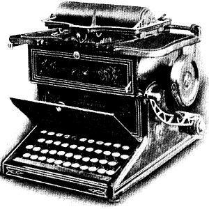

Universal Conceptual Cognitive Annotation (UCCA) is a novel semantic approach to grammatical representation. It was developed in the Computational Linguistics Lab of the Hebrew University by [Omri Abend](http://www.cs.huji.ac.il/~oabend) and [Ari Rappoport](http://www.cs.huji.ac.il/~arir).

The central idea of the project is to analyze and annotate natural languages using purely semantic categories and structure (a graph). Syntactic categories and structure are not part of the manual annotation, and are ideally learned implicitly by the parsers. The basic set of semantic categories (the foundational layer) is inspired by work in linguistic typology, cognitive grammar, and neuroscience. The development of additional layers, such as semantic roles and super-senses (adapted from the [CARMLS project](https://github.com/nert-gu/streusle/)) is underway.

The annotation so far focused on argument-structure and linkage phenomena. We build primarily on _Basic Linguistic Theory_ (R.M.W. Dixon, 2010a; 2010b; 2012), a widely used approach for language description. We acknowledge that there many applicable analyses for a given sentence, but select, for practical reasons, a small set of highly useful distinctions, and apply them to provide one plausible annotation.

We have annotated 160K tokens from English Wikipedia with the UCCA scheme, as well as a 30K English-French parallel corpus based on Jules Verne's "20K Leagues Under The Sea", and a 120K tokens corpus of the entire book in German. Pilot studies were conducted on several other languages as well.

This page contains links to all of UCCA's resources: corpora, annotation guidelines, parser and code. If you use these resources in your research, please cite the following or other relevant [publications](#publications):

| Universal Conceptual Cognitive Annotation (UCCA).
| ---
| [Omri Abend](https://www.cse.huji.ac.il/~oabend/) and [Ari Rappoport](http://www.cs.huji.ac.il/~arir), _[ACL 2013](http://acl2013.org)_.  
| [Paper: [pdf](https://www.aclweb.org/anthology/P13-1023.pdf)\]

## Annotation Web-App

UCCAApp is a web application for phrase-based annotation in general, and UCCA parsing in particular.
Formally, it supports DAG structures, discontiguous units and multiple categories.

The app supports configurable multi-layer annotation and task management, and is written in Django and AngularJS.

| UCCAApp: Web-application for Syntactic and Semantic Phrase-based Annotation.
| ---  
| [Omri Abend](https://www.cse.huji.ac.il/~oabend/), Shai Yerushalmi and [Ari Rappoport](http://www.cs.huji.ac.il/~arir). _[ACL 2017](http://acl2017.org)._  
| [Paper: [pdf](https://www.aclweb.org/anthology/P17-4019.pdf)\] [Code: [github](https://github.com/omriabnd/UCCA-App)\] [[Demo](http://ucca-demo.cs.huji.ac.il)\]

## Guidelines

UCCA-annotated [corpora](#ucca-annotated-corpora) include the guidelines version they were compiled with in their repository.
The most up to date guidelines are available on [github](https://github.com/UniversalConceptualCognitiveAnnotation/docs)
(the most recent one is generally in draft mode, but see [releases](https://github.com/UniversalConceptualCognitiveAnnotation/docs/releases)).

[v2 guidelines: [pdf](http://bit.ly/ucca_guidelines_v2)]
[latest guidelines: [pdf](https://github.com/UniversalConceptualCognitiveAnnotation/docs/raw/master/guidelines.pdf)]

## UCCA-Annotated Corpora

All publicly available with a [Creative Commons Attribution-ShareAlike 3.0 Unported](http://creativecommons.org/licenses/by-sa/3.0/) license.
The [guidelines](#guidelines) with which each of them was annotated can be found in the repository.

| Corpus | Link
| --- | ---
|  English Wikipedia | [[github](https://github.com/UniversalConceptualCognitiveAnnotation/UCCA_English-Wiki)\]
|  English Web Treebank | [[github](https://github.com/UniversalConceptualCognitiveAnnotation/UCCA_English-EWT)\]
|  English 20K Leagues Under The Sea | [[github](https://github.com/UniversalConceptualCognitiveAnnotation/UCCA_English-20K)\]
|  Excerpt of the PTB WSJ | [[github](https://github.com/UniversalConceptualCognitiveAnnotation/UCCA_English-WSJ)\]
|  German 20K Leagues Under The Sea | [[github](https://github.com/UniversalConceptualCognitiveAnnotation/UCCA_German-20K)\]
|  French 20K Leagues Under The Sea | [[github](https://github.com/UniversalConceptualCognitiveAnnotation/UCCA_French-20K)\]

## UCCA Parser

TUPA is a transition-based parser for Universal Conceptual Cognitive Annotation (UCCA), developed by Daniel Hershcovich, Omri Abend and Ari Rappoport.

| A Transition-Based Directed Acyclic Graph Parser for UCCA.
| ---
| [Daniel Hershcovich](http://www.cs.huji.ac.il/~danielh/), [Omri Abend](https://www.cse.huji.ac.il/~oabend/) and [Ari Rappoport](http://www.cs.huji.ac.il/~arir). [ACL 2017](http://acl2017.org).  
| [Paper: [pdf](https://www.aclweb.org/anthology/P17-1104.pdf)\] [Supp. Material: [pdf](https://www.aclweb.org/anthology/attachments/P17-1104.Notes.pdf)\] [Code: [github](https://github.com/danielhers/tupa/)\] [[Demo](http://www.cs.huji.ac.il/~danielh/ucca/)\]

It can be installed by: 

    pip install tupa

## Source Code

Python toolkit for reading and manipulating UCCA structures.
The code was written by Amit Beka and Daniel Hershcovich.

It can be installed by: 

    pip install ucca

[Code: [github](https://github.com/danielhers/ucca)\]

## Shared Tasks

UCCA was targeted in the following public parsing competitions, which accompanied top-tier NLP conferences:

**SemEval 2019 Task 1**

The task included open and closed tracks on English, French and German UCCA corpora from Wikipedia and Twenty Thousand Leagues Under the Sea.

Evaluation is done by labeled F1 on the graph edges, matched by child terminal yield.

| SemEval-2019 Task 1: Cross-lingual Semantic Parsing with UCCA.
| ---
| [Daniel Hershcovich](http://www.cs.huji.ac.il/~danielh/), Zohar Aizenbud, [Leshem Choshen](https://ktilana.wixsite.com/leshem-choshen/), [Elior Sulem](https://www.cis.upenn.edu/~eliors/), [Ari Rappoport](http://www.cs.huji.ac.il/~arir) and [Omri Abend](https://www.cse.huji.ac.il/~oabend/), _[SemEval 2019](http://alt.qcri.org/semeval2019/) (shared task)_.
| [Paper: [pdf](https://www.aclweb.org/anthology/S19-2001.pdf)] [Website: [link](https://competitions.codalab.org/competitions/19160)] [Training and development data: [link](https://competitions.codalab.org/my/datasets/download/fa60feac-54d1-43b1-9eba-48db775757ba)] [Test data: [link](https://competitions.codalab.org/my/datasets/download/8c020e3b-f68f-48f8-9629-bd92491d9295)] [Code: [github](https://github.com/danielhers/semeval-ucca)]

**CoNLL 2019 MRP Shared Task**

The task included parsing to [AMR](https://amr.isi.edu/), UCCA, [DM, PSD](http://sdp.delph-in.net/), and [EDS](http://moin.delph-in.net/EdsTop).
The UCCA training data is freely available.

UCCA evaluation is done both by UCCA F1 (as in SemEval 2019) and by the MRP metric, which is similar to [smatch](https://github.com/snowblink14/smatch). The training data contains 6,572 sentences from web reviews and Wikipedia. There are two evaluation sets: one with 1,131, from the same domains (Full), and one with 87 sentences, from The Little Prince (LPP). Note that due to an error, 535 of the 1,131 Full Evaluation sentences were included in the training data, and therefore the full evaluation scores are an overestimate. The LPP scores are unaffected by this.

| MRP 2019: Cross-Framework Meaning Representation Parsing.
| ---
| Stephan Oepen, Omri Abend, Jan Hajic, Daniel Hershcovich, Marco Kuhlmann, Tim O’Gorman, Nianwen Xue, Jayeol Chun, Milan Straka, Zdenka Uresova, _[CoNLL 2019](https://www.conll.org/2019) (shared task)_.
| [Paper: [pdf](https://www.aclweb.org/anthology/K19-2001.pdf)] [Website: [link](http://mrp.nlpl.eu/)] [UCCA data: [link](http://svn.nlpl.eu/mrp/2019/public/ucca.tgz)] [Code: [github](https://github.com/cfmrp/mtool)]

## Publications

| Content Differences in Syntactic and Semantic Representations.
| ---
| [Daniel Hershcovich](http://www.cs.huji.ac.il/~danielh/), [Omri Abend](https://www.cse.huji.ac.il/~oabend/) and [Ari Rappoport](http://www.cs.huji.ac.il/~arir). _[NAACL 2019](https://naacl2019.org/) (long paper)._  
| [Paper: [pdf](https://www.aclweb.org/anthology/N19-1047.pdf)\] [Supp. Material: [pdf](https://www.aclweb.org/anthology/attachments/N19-1047.Supplementary.pdf)\] [Code: [github](https://github.com/danielhers/synsem)\]

| Multitask Parsing Across Semantic Representations.
| ---
| [Daniel Hershcovich](http://www.cs.huji.ac.il/~danielh/), [Omri Abend](https://www.cse.huji.ac.il/~oabend/) and [Ari Rappoport](http://www.cs.huji.ac.il/~arir). _[ACL 2018](http://acl2018.org) (long paper)._  
| [Paper: [pdf](https://www.aclweb.org/anthology/P18-1035.pdf)\] [Supp. Material: [pdf](https://www.aclweb.org/anthology/attachments/P18-1035.Notes.pdf)\] [Code: [github](https://github.com/danielhers/tupa)\]

| Simple and Effective Text Simplification using Semantic and Neural Methods.
| ---
| [Elior Sulem](https://www.cis.upenn.edu/~eliors/), [Omri Abend](https://www.cse.huji.ac.il/~oabend/) and [Ari Rappoport](http://www.cs.huji.ac.il/~arir). _[ACL 2018](http://acl2018.org/)_ (long paper).  
| [Paper: [pdf](https://www.aclweb.org/anthology/P18-1016.pdf)\] [Data: [github](https://github.com/eliorsulem/simplification-acl2018)\]

| Reference-less Measure of Faithfulness for Grammatical Error Correction.
| ---
| [Leshem Choshen](https://ktilana.wixsite.com/leshem-choshen/) and [Omri Abend](https://www.cse.huji.ac.il/~oabend/). [NAACL 2018](http://naacl2018.org/) (short paper).  
| [Paper: [pdf](https://www.aclweb.org/anthology/N18-2020.pdf)\] [Supp. Material: [pdf](https://www.aclweb.org/anthology/attachments/N18-2020.Notes.pdf)\] [Code: [github](https://github.com/borgr/USim)\]

| Semantic Structural Evaluation for Text Simplification.
| ---
| [Elior Sulem](https://www.cis.upenn.edu/~eliors/), [Omri Abend](https://www.cse.huji.ac.il/~oabend/) and [Ari Rappoport](http://www.cs.huji.ac.il/~arir). [NAACL 2018](http://naacl2018.org/) (long paper).  
| [Paper: [pdf](https://www.aclweb.org/anthology/N18-1063.pdf)\] [Data & Code: [github](https://github.com/eliorsulem/SAMSA)\]

| A Transition-Based Directed Acyclic Graph Parser for UCCA.
| ---
| [Daniel Hershcovich](http://www.cs.huji.ac.il/~danielh/), [Omri Abend](https://www.cse.huji.ac.il/~oabend/) and [Ari Rappoport](http://www.cs.huji.ac.il/~arir). _[ACL 2017](http://acl2017.org) (long paper)._ Outstanding Paper Award.  
| [Paper: [pdf](https://www.aclweb.org/anthology/P17-1104.pdf)\] [Supp. Material: [pdf](https://www.aclweb.org/anthology/attachments/P17-1104.Notes.pdf)\] [Code: [github](https://github.com/danielhers/tupa/)\] [[Demo](http://www.cs.huji.ac.il/~danielh/ucca/)\]

| UCCAApp: Web-application for Syntactic and Semantic Phrase-based Annotation.
| ---
| [Omri Abend](https://www.cse.huji.ac.il/~oabend/), Shai Yerushalmi and [Ari Rappoport](http://www.cs.huji.ac.il/~arir). _[ACL 2017](http://acl2017.org) (demo paper)._  
| [Paper: [pdf](https://www.aclweb.org/anthology/P17-4019.pdf)\] [Code: [github](https://github.com/omriabnd/UCCA-App)\] [[Demo](http://ucca-demo.cs.huji.ac.il)\]

| The State of the Art in Semantic Representation.
| ---
| [Omri Abend](https://www.cse.huji.ac.il/~oabend/) and [Ari Rappoport](http://www.cs.huji.ac.il/~arir). _[ACL 2017](http://acl2017.org) (long paper)._  
| [Paper: [pdf](https://www.aclweb.org/anthology/P17-1008.pdf)\]

| HUME: Human UCCA-Based Evaluation of Machine Translation.
| ---
| [Alexandra Birch](http://homepages.inf.ed.ac.uk/abmayne/), [Omri Abend](https://www.cse.huji.ac.il/~oabend/), [Ondřej Bojar](http://www1.cuni.cz/~obo/) and [Barry Haddow](http://homepages.inf.ed.ac.uk/bhaddow/), _[EMNLP 2016](http://www.emnlp2016.net/) (long paper)._  
| [Paper: [pdf](https://www.aclweb.org/anthology/D16-1134.pdf)\] [Data: [github](https://github.com/bhaddow/hume-emnlp16)\] [[Demo](https://www.cse.huji.ac.il/~oabend/hume_demo.html)\]

| Conceptual Annotations Preserve Structure Across Translations: A French-English Case Study.
| ---
| [Elior Sulem](https://www.cis.upenn.edu/~eliors/), [Omri Abend](https://www.cse.huji.ac.il/~oabend/) and [Ari Rappoport](http://www.cs.huji.ac.il/~arir), _[ACL 2015 Workshop on Semantics-Driven Statistical Machine Translation (S2MT)](http://hlt.suda.edu.cn/workshop/s2mt/)._  
| [Paper: [pdf](https://www.aclweb.org/anthology/W15-3502.pdf)\]

| Universal Conceptual Cognitive Annotation (UCCA).
| ---
| [Omri Abend](https://www.cse.huji.ac.il/~oabend/) and [Ari Rappoport](http://www.cs.huji.ac.il/~arir), _[ACL 2013](http://acl2013.org) (long paper)_.  
| [Paper: [pdf](https://www.aclweb.org/anthology/P13-1023.pdf)\]

| UCCA: A Semantics-based Grammatical Annotation Scheme.
| ---
| [Omri Abend](https://www.cse.huji.ac.il/~oabend/) and [Ari Rappoport](http://www.cs.huji.ac.il/~arir), _[IWCS 2013](http://www.ling.uni-potsdam.de/iwcs2013/) (long paper)_.  
| [Paper: [pdf](https://www.aclweb.org/anthology/W13-0101.pdf)\]

## Theses

| Universal Semantic Parsing with Neural Networks.
| ---
| [Daniel Hershcovich](https://danielhers.github.io/), PhD Thesis,  
| The Hebrew University of Jerusalem, 2019  
| [Paper: [pdf](https://danielhers.github.io/thesis.pdf)\]

| Measuring Semantic Preservation in Machine Translation with HCOMET: Human Cognitive Metric for Evaluating Translation.
| ---
| Pedro Marinotti, MSc Thesis,  
| The University of Edinburgh, 2014  
| [Paper: [pdf](https://www.cse.huji.ac.il/~oabend/papers/pedro_thesis.pdf)\]

| Integration of a cognitive annotation into machine translation: Theoretical foundations and bilingual corpus analysis.
| ---
| [Elior Sulem](https://www.cis.upenn.edu/~eliors/), MSc Thesis,  
| The Hebrew University of Jerusalem, 2014  
| [Paper: [pdf](https://www.cse.huji.ac.il/~oabend/ucca/Elior_Sulem_thesis.pdf)\]

| Semi-supervised identification of scene-evoking nouns in UCCA.
| ---
| Amit Beka, MSc Thesis,  
| The Hebrew University of Jerusalem, 2013  
| [Paper: [pdf](https://www.cse.huji.ac.il/~oabend/papers/beka_thesis.pdf)\]

| Grammatical Annotation Founded on Semantics: A Cognitive Linguistics Approach to Grammatical Corpus Annotation.
| ---
| [Omri Abend](https://www.cse.huji.ac.il/~oabend/), PhD Thesis,  
| The Hebrew University of Jerusalem, 2013  
| [Paper: [pdf](https://www.cse.huji.ac.il/~oabend/papers/omri_thesis.pdf)\]

## Reports

| Distinguishing Human Translations and Machine Outputs with UCCA.
| ---
| Michal Kessler, Lab Report,  
| The Hebrew University of Jerusalem, 2019  
| [Paper: [pdf](https://www.cse.huji.ac.il/~oabend/ucca/michal_lab_summary.pdf)\]

## Contact

For any questions or feedback, please email Omri Abend at _oabend@cs.huji.ac.il_.
